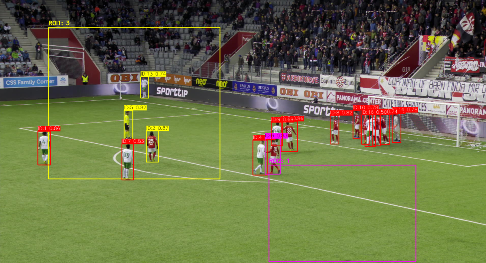

# Artificial Vision Project - Gruppo 18
## Soccer Player Tracking and Behavior Analysis

Questo repository contiene la soluzione del Gruppo 18 per la challenge di Artificial Vision. Il sistema esegue il tracciamento dei giocatori e il conteggio nelle ROI specificate, utilizzando **YOLO11** per la detection e BoT-SORT per il tracking, **integrando un filtraggio avanzato basato sul colore del campo (HSV)**.
### 📋 Requisiti
Il progetto è stato sviluppato e testato su Python 3.8+.

**Installazione delle dipendenze:**
Eseguire il seguente comando per installare tutte le librerie necessarie:
```bash
pip install -r requirements.txt
```

(Nota: Il file requirements.txt deve includere: `ultralytics , opencv-python, numpy, pandas, pyyaml, tqdm, trackeval`)

---

### 📂 Struttura Cartelle Richiesta
Il sistema si aspetta la seguente struttura per i dati di input, conforme alla traccia del progetto:
```
project_root/
├── dataset/
│   └── raw_data/
│       └── test/             <-- Inserire qui le cartelle dei video di gara (es. "016", etc.)
│           ├── XXX/          <-- Id del video
│           │   ├── img1/     <-- Sequenza immagini .jpg
│           │   ├── gt/       <-- Cartella che contiene le ground thruth per track e behavior ("gt.txt", "behavior_gt.txt")
│           │   ├── gameinfo.ini
│           │   ├── roi.json  <-- File roi
│           │   └── ...
│           └── ...
├── configs/
│   ├── config.yaml           <-- Configurazione principale
│   └── tracking.yaml         <-- Configurazione tracker e filtri
│   
├── weights/
│   └── yolo11x.pt            <-- Pesi del modello (assicurarsi siano presenti)
├── src/                      <-- Codice sorgente
└── main.py                   <-- Script principale
```
---
### 🛠️ Setup Iniziale (Preparazione Dati)
Prima di eseguire il tracking o la valutazione, è necessario preparare il dataset. **Si noti che questo procedimento è stato implementato solo perché il dataset a noi fornito non era già pronto; in caso di dataset già pronto, questa operazione non deve essere eseguita.**

Questa modalità si occupa di estrarre gli archivi, standardizzare i nomi delle cartelle (rimuovendo il prefisso "SNMOT-"), distribuire i file ROI e generare la Ground Truth necessaria per l'analisi del comportamento.

```bash
python main.py --mode prepare
```

_Nota_: Durante questo processo, la classe "Ball" viene rimossa dai file di Ground Truth per ottimizzare il tracciamento dei soli soggetti umani.

---
### 🚀 Esecuzione (Setup di Gara)
Per avviare l'elaborazione completa (Tracking + Behavior Analysis) su tutti i video presenti nella cartella di test, eseguire il comando:

```
python main.py --mode contest --config configs/config.yaml
```
**⚠️ Importante - Configurazione Percorsi (`configs/config.yaml`):**
In modalità contest, è fondamentale garantire la coerenza tra i percorsi definiti nel file di configurazione affinché sia l'elaborazione che il simulatore funzionino sugli stessi dati. Assicurarsi che:

1.  La variabile `paths.split` corrisponda al nome della sottocartella contenente i video del contest (es. `"test"` o `"contest"`) presente dentro `raw_data`.
2.  Il percorso completo risultante dalla concatenazione di **`paths.raw_data`** e **`paths.split`** deve essere identico al percorso specificato in **`paths.video_contest`**.
    * *Esempio:* Se `raw_data` è `"./dataset/raw_data"` e `split` è `"contest"`, allora `video_contest` deve essere impostato a `"../../dataset/raw_data/contest"`.

**Descrizione del processo:**

1.  **Inizializzazione:** Lo script carica le configurazioni globali da `configs/config.yaml` e i parametri specifici di tracking dal file passato come argomento (`tracking.yaml`).
2.  **Tracking:** Esegue il tracciamento dei giocatori utilizzando YOLO e BoT-SORT, applicando un `FieldFilter` per rimuovere rilevamenti fuori dal campo di gioco (sugli spalti).
3.  **Behavior Analysis:** Analizza le posizioni dei giocatori rispetto alle ROI definite per conteggiare le presenze.
4.  **Output:** Genera i file di testo richiesti per la sottomissione.
---
### 🔬 Validazione e Grid Search
Il progetto include un modulo `validator.py` utilizzato in fase di sviluppo per identificare i migliori iperparametri del modello.

Scopo: Questo script esegue una Grid Search iterando su diverse combinazioni di soglie di confidenza (`conf_threshold`) e soglie di IoU (`iou_threshold`). Per ogni combinazione, calcola la metrica DetA (Detection Accuracy) basata su Precision e Recall, salvando i risultati in un file CSV per determinare la configurazione ottimale.

Comando:
```bash
python main.py --mode val --config configs/val.yaml
```
---
### 🎮 Simulatore e Visualizzazione Interattiva
Il progetto include uno strumento dedicato (`simulator.py`) per visualizzare graficamente i risultati generati dal Contest Runner e calcolare le metriche in tempo reale. Questo tool mostra a video il confronto tra Ground Truth (sinistra) e Predizioni (destra), utilissimo per il debug qualitativo.

Come avviare il simulatore:
\
Poiché lo script dipende da percorsi relativi, è necessario spostarsi nella cartella del simulatore prima di eseguirlo:

```bash
cd src/simulator
python simulator.py
```
Cosa fa lo script:

1. Legge la configurazione da `../../configs/config.yaml`.

2. Carica i risultati generati (file `.txt`) dalla cartella di output definita nel config (`output_contest`).

3. Apre una finestra interattiva che mostra il video con:

   * Bounding Box dei giocatori.

   * Conteggi nelle ROI (Behavior Analysis).

   * Confronto GT vs Predizioni.

4. Al termine della visualizzazione, calcola e stampa a terminale le metriche HOTA@0.5 e nMAE.

**Comandi Interattivi**:

* `Spazio`: Pausa/Riprendi video.

* `n`: Passa al video successivo.

* `q` o `Esc`: Chiudi e termina.

---
### 📷 Esempi di Visualizzazione
Di seguito sono riportati esempi dell'output visivo generato dal sistema, che illustrano sia il tracciamento che l'analisi nelle aree di interesse (ROI).

**1. Output Tracking & Behavior Analysis**
Questa è la vista principale offerta dal **Simulatore** (o attivando `display: True` in `tracking.yaml`).
Oltre ai **Bounding Box** dei giocatori (con ID e confidenza), sono visibili le **ROI (Regions of Interest)** configurate (rettangoli giallo e viola): il sistema conta in tempo reale quanti giocatori si trovano all'interno di ciascuna area per l'analisi comportamentale.


**2. Debug Filtro Campo (Modalità Mosaic)**
Attivando l'opzione `debug_mosaic: True` nel file di configurazione `tracking.yaml`, è possibile ispezionare la pipeline di filtraggio del campo di gioco.
* **Top-Left:** Frame originale con visualizzazione delle ROI e del tracking.
* **Top-Right:** Maschera HSV grezza (Raw).
* **Bottom-Left:** Risultato dopo le operazioni morfologiche (pulizia del rumore).
* **Bottom-Right:** Maschera finale (Hole Filling), utilizzata per escludere le detection sugli spalti.


---
### 🛠️ Modalità Alternative di Esecuzione
Oltre alla modalità contest, è possibile eseguire i moduli singolarmente per debug o test specifici.

1. Tracking Singolo
Esegue solo la pipeline di tracking (Detection + Tracking + Field Filtering) e genera i file `tracking_X_XX.txt`. Include la visualizzazione video se `display: True` in `tracking.yaml`.

```bash
python main.py --mode track --config configs/tracking.yaml
```
2. Behavior Analysis Singolo
Esegue solo l'analisi del comportamento (conteggio nelle ROI) assumendo di avere accesso ai frame e al tracker. Genera i file `behavior_X_XX.txt`.

```bash
python main.py --mode roi --config configs/tracking.yaml
```

---
### 📊 Valutazione e Calcolo Score Finale (PTBS)
Per calcolare il punteggio finale basato sui risultati ottenuti dal run del contest, seguire questi passaggi:

**Passo 1**: Configurazione Percorso Valutazione\
Aprire il file `configs/config.yaml` e assicurarsi che la voce `output_subdirs` punti alla cartella dei risultati appena generati. Esempio (se il `test_name` in `tracking.yaml` era `track_prova_contest_runner`):

```
YAML

# In configs/config.yaml
paths:
  ...
  output_subdirs: ["track_prova_contest_runner/results"]
```
**Passo 2**: Calcolo Metrica Tracking (HOTA@0.5)\
Eseguire il comando di valutazione per il tracking:

```bash
python main.py --mode eval_hota
```
Il sistema calcolerà l'HOTA score confrontando le predizioni con la Ground Truth (se presente). Il risultato sarà stampato a video come `GLOBAL HOTA SCORE` e salvato nel file `execution_report.json` nella cartella dei risultati.

**Passo 3**: Calcolo Metrica Behavior (nMAE)\
Eseguire il comando di valutazione per il behavior:

```bash
python main.py --mode eval_roi
```

Il sistema calcolerà il Mean Absolute Error normalizzato (nMAE). Il risultato sarà stampato a video e salvato nel report.

**Passo 4**: Calcolo Punteggio Finale (PTBS)\
Il punteggio finale PTBS (Player Tracking and Behavior Score) si ottiene sommando i due valori calcolati sopra:

$$ PTBS = HOTA_{0.5} + nMAE $$

Dove:

* $HOTA_{0.5}$: Valore ottenuto dal passo 2 (range 0-100 o 0-1, assicurarsi di usare la scala 0-1 per la somma se nMAE è in 0-1).

* nMAE: Valore ottenuto dal passo 3 (range 0-1).


---
### ⚙️ Dettagli File di Configurazione
#### 1. File `configs/config.yaml`.
Questo file gestisce i percorsi globali e le impostazioni generali del progetto.

| Parametro | Descrizione |
| :--- | :--- |
| `project_name` | Nome del progetto (utilizzato nei log o output YOLO). |
| `device` | ID del dispositivo hardware (es. `0` per GPU, `cpu` per CPU). |
| `fps` | Frame rate di riferimento per le valutazioni temporali (default: 25). |
| `names.team` | ID numerico del team (es. `18`), usato per nominare i file di output. |
| `paths.raw_data` | Percorso alla cartella contenente i video di test/train. |
| `paths.roi` | Percorso al file JSON di configurazione delle ROI di default. |
| `paths.split` | Sottocartella da utilizzare dentro `raw_data` (es. `test`). |
| `paths.yolo_dataset` | Cartella temporanea/di appoggio per conversione dataset YOLO. |
| `paths.model_weights` | Percorso al file dei pesi del modello (`.pt`). |
| `paths.output_submission` | Directory principale dove verranno salvati tutti i risultati. |
| `paths.output_subdirs` | Lista delle sottocartelle su cui lanciare gli script di valutazione. |
| `paths.output_val` | Directory output per i risultati della grid search (Validator). |
| `paths.temp_tracker_yaml` | File temporaneo per passare la config al tracker interno di Ultralytics. |
| `paths.video_contest` | Percorso base per i video del contest (utilizzato come `dataset_root` in `simulator.py`). Es: `../../dataset/contest.` |
| `paths.output_contest` | Directory specifica dove il simulatore cerca i file generati. |

#### 2. File `configs/tracking.yaml`
Questo file controlla i parametri specifici dell'algoritmo di tracking e di filtraggio.

⚠️ **ATTENZIONE:** La maggior parte dei parametri in questo file (soglie confidenza, IoU, HSV, parametri BoT-SORT) sono stati ottimizzati tramite test e non devono essere modificati.

**GLI UNICI CAMPI CHE VANNO MODIFICATI SONO:**

* `test_name`: Nome della cartella di output dove verranno salvati i risultati (es. `risultati_gara_finale`).
* `display`: (`True`/`False`) Abilita o disabilita la visualizzazione a video durante l'elaborazione.
* `field_det_settings -> debug`: (`True`/`False`) Attiva la modalità debug per il filtro campo.
* `field_det_settings -> debug_mosaic`:
    * `True`: Mostra i 4 stadi del filtro per calibrazione avanzata.
    * `False`: Mostra solo il contorno verde del campo.

---


### 📤 Output

La destinazione dei file di output dipende dalla modalità di esecuzione scelta.
Il percorso base è definito in `config.yaml` (`./output/submissions/`) combinato con il `test_name` definito in `tracking.yaml`.

**1. Modalità Contest (`--mode contest`)**
Tutti i risultati vengono salvati in un'unica cartella unificata (pronta per la consegna):
> `./output/submissions/<test_name>/results/`

**2. Modalità Singole (`--mode track` o `--mode roi`)**
I risultati vengono organizzati in sottocartelle separate per mantenere ordine durante il debug:
-   **Tracking:** `./output/submissions/<test_name>/track/`
-   **Behavior:** `./output/submissions/<test_name>/behavior/`

**Formato dei file:**
Indipendentemente dalla cartella di salvataggio, i file generati seguono le specifiche della traccia:

* `tracking_K_XX.txt` (es. `tracking_1_18.txt`):
    Contiene: `frame_id`, `object_id`, `x`, `y`, `w`, `h`.
* `behavior_K_XX.txt` (es. `behavior_1_18.txt`):
    Contiene: `frame_id`, `region_id`, `n_players`.\
(Dove `18` è l'ID del nostro Team)
---
### 👥 Autori - Gruppo 18
- Simone Faraulo
- Ivan Luigi Cipriano
